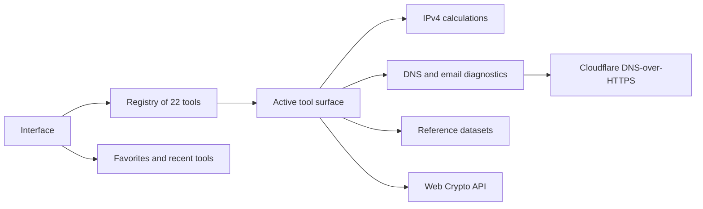

# Network Engineer Toolbox

<p align="center">
  
</p>

<p align="center">
  Practical network calculations, diagnostics, and references.<br />
  One calm workspace for the technical details that still need to be correct.
</p>

<p align="center">
  <a href="https://github.com/0x000TheNULL/Net-Tools"><strong>Repository</strong></a>
  ·
  <a href="https://msyaddin.cloud"><strong>Built by Muhammad Syawalludin</strong></a>
</p>

## So, what is this?

**Network Engineer Toolbox** is a collection of practical utilities for network engineers, system engineers, cloud engineers, and anyone whose average workday includes IP addresses, DNS records, email authentication, ports, VLANs, or technical data that looks simple right up until one number is wrong.

Instead of jumping between websites to calculate a subnet, inspect SPF, encode Base64, and generate a SHA-256 digest, this project puts all of that in one focused workspace.

The interface works like a modern productivity app: a clear tool directory on the left, one focused workspace in the middle, and structured results that are easy to scan and copy. The engineering stays detailed without dressing everything up like a terminal.

The short version:

- **22 utilities** across five practical categories.
- Calculations and cryptographic operations run locally whenever possible.
- DNS lookups use DNS-over-HTTPS.
- Global search, favorites, recent tools, and a command palette are built in.
- No account is required.
- No fake activity graphs moving around just to look important.

## What is inside?

| Category | What it handles | Count |
| --- | --- | ---: |
| IP & Subnet | Address planning, masks, ranges, and wildcard calculations | 5 tools |
| DNS | Record lookups and email-related DNS checks | 4 tools |
| Email | SPF, DKIM, DMARC, and email-header analysis | 4 tools |
| Network | Ports, CIDR, IP ranges, VLANs, and HTTP references | 5 tools |
| Utilities | Encoding, hashing, encryption, key derivation, and JSON | 4 tools |

## IP & Subnet

IPv4 calculations that can technically be done by hand. They can also be done faster and more consistently by the browser, which feels like the better use of everyone's afternoon.

| Tool | What you get |
| --- | --- |
| Subnet Calculator | Network address, broadcast address, subnet mask, wildcard, first and last host, and capacity. |
| CIDR to Subnet Mask | Converts a prefix such as `/24` into `255.255.255.0`. |
| Subnet Mask to CIDR | Validates a dotted-decimal mask and resolves its CIDR prefix. |
| IP Range Calculator | Counts the addresses between a starting and ending IPv4 address. |
| Wildcard Mask Calculator | Generates the inverse mask used by ACLs and routing protocols. |

## DNS

Quick DNS inspection without opening a terminal when all you need is a clear look at the records.

| Tool | What you get |
| --- | --- |
| DNS Lookup | Queries `A`, `AAAA`, `CNAME`, `MX`, `TXT`, `NS`, `SOA`, and `PTR` records. |
| Reverse DNS Lookup | Converts IPv4 into a reverse lookup name and retrieves its PTR record. |
| MX Lookup | Shows domain mail exchangers and their priorities. |
| TXT / SPF Lookup | Retrieves TXT records and isolates the SPF policy. |

Queries are sent to Cloudflare's JSON DNS-over-HTTPS endpoint. That means the domain name and requested record type leave the browser. Inputs from unrelated local tools do not tag along for the trip.

## Email

Email authentication looks like a few TXT records until one character is wrong and messages start drifting into spam. These tools make the records easier to inspect before that becomes everyone's problem.

| Tool | What you get |
| --- | --- |
| SPF Record Checker | Parses mechanisms, estimates DNS-lookup pressure, and identifies the terminal policy. |
| DKIM Selector Helper | Builds selector-specific DKIM hostnames and queries public-key records. |
| DMARC Record Checker | Reads enforcement policy, reporting addresses, percentages, and alignment settings. |
| Email Header Analyzer | Parses identities, message metadata, authentication verdicts, and received hops. |

## Network

The references people usually need while something is already on fire. Search by number, service name, or the one keyword you still remember.

| Tool | What you get |
| --- | --- |
| Port Reference | Common TCP/UDP ports, service names, and operational notes. |
| CIDR Reference Table | Prefixes, subnet masks, total addresses, and usable host counts. |
| Private / Public IP Reference | Private, public, loopback, link-local, multicast, and reserved ranges. |
| VLAN ID Reference | Normal, extended, and reserved IEEE 802.1Q VLAN ranges. |
| HTTP Status Reference | Searchable HTTP responses by code, class, or meaning. |

## Utilities

Small data transformations that always seem to appear at the least convenient moment.

| Tool | What you get |
| --- | --- |
| Base64 Encode / Decode | Converts UTF-8 text to Base64 and back. |
| URL Encode / Decode | Encodes and decodes URI component values. |
| Encode & Crypto Lab | Ten accurately classified encoding and cryptographic workflows. |
| JSON Formatter / Validator | Validates, formats, minifies, copies, and exports JSON. |

## The crypto section, where not everything gets called “encryption”

SHA-256 is a **hash**, not encryption. Base64 is **encoding**, not a clever way to hide a password. PBKDF2 **derives key material**; it does not encrypt a message.

That distinction may sound overly specific until the output lands in production documentation, an audit, or a configuration somebody has to maintain six months later.

| No. | Method | What it actually does | Reversible? |
| ---: | --- | --- | :---: |
| 01 | Base64 | Encodes binary data as text | Yes |
| 02 | URL Percent | Encodes URI components | Yes |
| 03 | SHA-256 | Produces a 256-bit one-way hash | No |
| 04 | SHA-384 | Produces a 384-bit one-way hash | No |
| 05 | SHA-512 | Produces a 512-bit one-way hash | No |
| 06 | HMAC-SHA-256 | Signs message integrity with a secret | Verified, not decoded |
| 07 | AES-GCM-256 | Authenticated symmetric encryption | Yes, with the key |
| 08 | AES-CBC-256 | Symmetric encryption for legacy compatibility | Yes, with the key |
| 09 | RSA-OAEP-2048 | Asymmetric public/private-key encryption | Yes, with the private key |
| 10 | PBKDF2-SHA-256 | Derives a key from a passphrase | No |

### Things worth knowing before pressing the button

- AES uses a 32-byte key represented as 64 hexadecimal characters.
- AES-GCM uses a random 96-bit IV and produces authenticated ciphertext.
- AES-CBC uses a random 128-bit IV but **does not authenticate the ciphertext**. Unless compatibility is forcing the decision, use AES-GCM.
- RSA key pairs are generated in the browser and exported as SPKI public-key and PKCS#8 private-key PEM values.
- RSA-OAEP 2048 with SHA-256 accepts up to 190 UTF-8 bytes here. For larger data, encrypt the payload with AES and use RSA to wrap the AES key.
- PBKDF2 accepts between 10,000 and 2,000,000 iterations and returns a 256-bit key.
- Keys, plaintext, and ciphertext stay in component state unless you copy them somewhere else.

> [!IMPORTANT]
> The Crypto Lab is an engineering utility, not a key-management platform. Long-lived production keys still belong in a proper secret manager, KMS, or HSM-backed system. A meeting-notes document does not count. Seriously.

## How it works, without making it dramatic



There is no database and no custom application backend for the current feature set. Almost everything runs in the browser. DNS lookups are the obvious exception because DNS records do, unfortunately, need to be requested from a resolver.

## The stack

| Layer | Technology | Why it is here |
| --- | --- | --- |
| UI | React 19 | A clean component model for many tools that share interaction patterns. |
| Language | TypeScript 5.9 | Technical data already has enough surprises. Types do not need to add more. |
| Runtime | Vinext | A Next-compatible runtime with Cloudflare Workers output. |
| Styling | Tailwind CSS 4 + CSS tokens | Fast utility styling with the actual visual identity kept in a project design system. |
| UI primitives | shadcn-compatible + Base UI | Solid interaction primitives without rebuilding every control from scratch. |
| Icons | Lucide React | Small, consistent, and easier than maintaining a folder of mystery SVGs. |
| Cryptography | Web Crypto API | Native browser cryptography without sending keys to an application server. |
| DNS | Cloudflare DNS-over-HTTPS | DNS queries over HTTPS with JSON responses. |
| Build | Vite + Vinext + Wrangler | A build and runtime path that fits Cloudflare Workers. |
| Quality | Oxlint + Oxfmt | Keeps the codebase from slowly turning into a storage closet. |

## Running it locally

You will need:

- Node.js `22.13.0` or newer
- npm
- A modern browser with Web Crypto API support

```bash
git clone https://github.com/0x000TheNULL/Net-Tools.git
cd Net-Tools
npm ci
npm run dev
```

Then open [http://localhost:3000](http://localhost:3000).

### Available commands

| Command | What it does |
| --- | --- |
| `npm run dev` | Starts the development server. |
| `npm run build` | Creates the production build. |
| `npm run start` | Runs the generated Worker locally through Wrangler. |
| `npm run lint` | Runs Oxlint. |
| `npm run format` | Formats supported files with Oxfmt. |

## Project structure, for anyone planning to poke around

```text
Net-Tools/
├── app/                    # Routes, metadata, and the global design system
├── components/             # Landing page, toolbox shell, and UI primitives
├── data/                   # Central tool registry
├── features/tools/         # Tools rendered inside the workspace
│   ├── crypto-lab.tsx
│   ├── dns-tools.tsx
│   ├── network-tools.tsx
│   ├── shared.tsx
│   ├── tool-surface.tsx
│   └── utility-tools.tsx
├── lib/                    # Network, DNS, crypto, codec, and reference logic
├── public/                 # Favicon and social-preview artwork
├── types/                  # Shared TypeScript types
├── package.json
└── vite.config.ts
```

The files most likely to matter first:

- `data/tools.ts` — names, categories, descriptions, tags, and stable internal IDs.
- `features/tools/tool-surface.tsx` — connects registry entries to their interactive components.
- `lib/network.ts` — IPv4 parsing and calculations.
- `lib/dns.ts` — DNS-over-HTTPS plus SPF, DMARC, and email-header parsing.
- `lib/crypto.ts` — digests, HMAC, AES, RSA, and PBKDF2.
- `lib/reference-data.ts` — datasets used by the searchable reference tables.

## Where does your data go?

### Stays in the browser

- IPv4 and subnet calculations
- Reference-table searches
- Base64 and URL transformations
- JSON formatting and validation
- SHA and HMAC operations
- AES and RSA operations
- PBKDF2 key derivation
- Email-header parsing
- Favorites and recent tools

### Leaves the browser

DNS lookups send the domain or reverse lookup name and requested record type to:

```text
https://cloudflare-dns.com/dns-query
```

The request uses `Accept: application/dns-json`. The application currently has no first-party analytics, user-account system, database, or server-side secret storage.

## A small note about state

Lightweight preferences are stored in `localStorage`:

| Key | What it contains |
| --- | --- |
| `netops:favorites` | IDs of tools pinned by the user |
| `netops:recent` | The five most recently opened tool IDs |
The command palette opens with `Ctrl+K` or `⌘K`. Global search matches tool names, descriptions, categories, and tags.

## The visual system

The toolbox is designed as a light productivity app that belongs next to [msyaddin.cloud](https://msyaddin.cloud), not as a cybersecurity dashboard. The shared system uses Manrope for the interface, a warm `#e9e0d2` canvas, `#f1e9dd` surfaces, `#241c18` text, and a restrained `#a44730` accent. Corners stay square, borders do most of the separating, and shadows are kept quiet.

Monospace is reserved for values where alignment genuinely helps: IP addresses, subnet masks, hashes, keys, JSON, encoded text, and similar technical output. Navigation, labels, buttons, and explanations use the regular interface typeface.

On smaller screens, navigation becomes a slide-over panel, forms collapse to a single column, and wide reference data keeps its horizontal overflow instead of becoming a tower of tiny cards.

## What has been checked

- The production build completes successfully with `npm run build`.
- The landing page and workspace were inspected in a real browser.
- SHA-256 was generated through the rendered interface, not just a separate helper function.
- AES-GCM-256 completed an encrypt/decrypt round trip back to the original plaintext.
- RSA-OAEP-2048 generated a key pair and completed an encrypt/decrypt round trip.
- Desktop layout, responsive rules, search, favorites, tool URLs, and the command palette were inspected.
- `git diff --check` was clean before publication.

This repository includes a fairly large set of generated shadcn-compatible primitives. A full lint run may surface accessibility or compiler rules in unused generated primitives. The production build and active application paths are validated separately.

## Deployment

The build targets a Cloudflare Workers-compatible runtime through Vinext and Wrangler.

```bash
npm run build
npm run start
```

This is not a plain static-export project, so GitHub Pages is not the default deployment target. The source can happily live on GitHub, while the generated application runs on a platform that supports Workers and Vinext.

## Want to add another tool?

Go for it. The usual path looks like this:

1. Add a `ToolDefinition` to `data/tools.ts`.
2. Create the tool component under `features/tools/`.
3. Register its icon and renderer in `features/tools/tool-surface.tsx`.
4. Keep pure calculation or parsing logic in `lib/` whenever possible.
5. Include empty, loading, validation, and error states. The happy path is not the only path.
6. Check keyboard navigation and the mobile layout.
7. Run the production build before opening a pull request.

New features should keep the same basic principles: use accurate terminology, keep local data local, make results easy to read, and let the interface stay calm.

## License

No open-source license has been added yet. The repository is publicly viewable, but that does not automatically grant permission to copy, modify, or redistribute the code. Copyright remains with the author until a license says otherwise.

## Author

**Muhammad Syawalludin**  
Technology / Infrastructure Engineer

- Personal site: [msyaddin.cloud](https://msyaddin.cloud)
- GitHub: [@0x000TheNULL](https://github.com/0x000TheNULL)

---

Built for the ordinary network questions that still deserve a clear, reliable answer.
