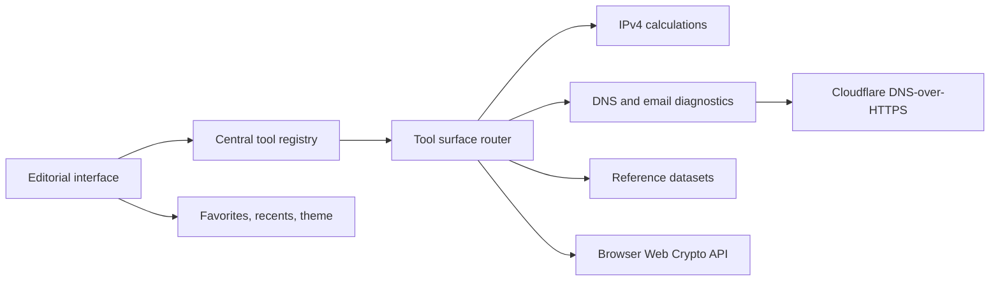

# Network Engineer Toolbox

<p align="center">
  
</p>

<p align="center">
  A local-first, browser-based engineering field manual for IP planning, DNS diagnostics,
  email authentication, network references, encoding, and practical cryptography.
</p>

<p align="center">
  <a href="https://github.com/0x000TheNULL/Net-Tools"><strong>Repository</strong></a>
  ·
  <a href="https://msyaddin.cloud"><strong>Personal site</strong></a>
</p>

## Overview

Network Engineer Toolbox brings the small utilities used during troubleshooting, change windows, migration work, and infrastructure reviews into one focused interface.

The product is designed as an **interactive engineering field manual**, not a generic administration dashboard. It combines large editorial typography, indexed tool identifiers, compact technical metadata, structured results, searchable references, and keyboard-driven navigation.

The current release contains **22 utilities across five operational chapters**:

| Chapter | Scope | Tools |
| --- | --- | ---: |
| `01 / IP & Subnet` | IPv4 planning, masks, ranges, and wildcard calculations | 5 |
| `02 / DNS` | DNS-over-HTTPS lookups and mail-related DNS inspection | 4 |
| `03 / Email` | SPF, DKIM, DMARC, and mail-header analysis | 4 |
| `04 / Network` | Ports, CIDR, IP ranges, VLANs, and HTTP references | 5 |
| `05 / Utilities` | Encoding, cryptography, hashing, and JSON workflows | 4 |

## Product principles

- **Local first** — calculations, codecs, JSON processing, and cryptographic operations stay in the browser.
- **Technically explicit** — encoding, hashing, authentication, encryption, and key derivation are presented as different operations.
- **Operationally useful** — outputs are structured for quick reading, copying, and use during real engineering work.
- **Quiet interface, louder data** — technical values carry the visual hierarchy instead of decorative dashboards or fake telemetry.
- **Fast navigation** — global search, chapter navigation, favorites, recent tools, and a command palette reduce tool hunting.

## Tool catalog

### 01 / IP & Subnet

| ID | Tool | Purpose |
| --- | --- | --- |
| `IP/001` | Subnet Calculator | Resolves the network address, broadcast address, subnet mask, wildcard mask, first and last host, capacity, and binary network notation. |
| `IP/002` | CIDR to Subnet Mask | Converts an IPv4 prefix length into dotted-decimal mask notation. |
| `IP/003` | Subnet Mask to CIDR | Validates a dotted-decimal mask and resolves its prefix length. |
| `IP/004` | IP Range Calculator | Measures an IPv4 start/end range and its total address capacity. |
| `IP/005` | Wildcard Mask Calculator | Generates the inverse mask used by ACLs and routing protocols. |

### 02 / DNS

| ID | Tool | Purpose |
| --- | --- | --- |
| `DNS/001` | DNS Lookup | Queries `A`, `AAAA`, `CNAME`, `MX`, `TXT`, `NS`, `SOA`, and `PTR` records. |
| `DNS/002` | Reverse DNS Lookup | Converts an IPv4 address into its reverse lookup name and queries the associated PTR record. |
| `DNS/003` | MX Lookup | Inspects domain mail exchangers and their priorities. |
| `DNS/004` | TXT / SPF Lookup | Retrieves TXT records and isolates the domain's SPF policy. |

DNS queries use Cloudflare's JSON DNS-over-HTTPS endpoint. The requested domain name and record type are sent to that provider; unrelated local tool inputs are not.

### 03 / Email

| ID | Tool | Purpose |
| --- | --- | --- |
| `MAIL/001` | SPF Record Checker | Parses mechanisms, estimates DNS-lookup pressure, and identifies the terminal `all` policy. |
| `MAIL/002` | DKIM Selector Helper | Builds selector-specific DKIM record names and queries their public key records. |
| `MAIL/003` | DMARC Record Checker | Inspects enforcement policy, reporting destinations, percentages, and alignment settings. |
| `MAIL/004` | Email Header Analyzer | Parses identities, message metadata, authentication verdicts, and received hops. |

### 04 / Network

| ID | Tool | Purpose |
| --- | --- | --- |
| `NET/001` | Port Reference | Searches common TCP/UDP ports, service names, and operational notes. |
| `NET/002` | CIDR Reference Table | Compares prefixes, subnet masks, total addresses, and usable host counts. |
| `NET/003` | Private / Public IP Reference | Classifies common private, public, loopback, link-local, multicast, and reserved ranges. |
| `NET/004` | VLAN ID Reference | Documents normal, extended, and reserved IEEE 802.1Q VLAN ranges. |
| `NET/005` | HTTP Status Reference | Searches common response codes by code, class, and meaning. |

### 05 / Utilities

| ID | Tool | Purpose |
| --- | --- | --- |
| `UTIL/001` | Base64 Encode / Decode | Converts UTF-8 text to or from Base64 locally. |
| `UTIL/002` | URL Encode / Decode | Encodes or decodes URI component values. |
| `UTIL/003` | Encode & Crypto Lab | Provides ten accurately classified encoding and cryptographic workflows. |
| `UTIL/004` | JSON Formatter / Validator | Validates, formats, minifies, copies, and exports JSON payloads. |

## Encode & Crypto Lab

The Crypto Lab intentionally avoids calling every method “encryption.” SHA digests cannot be decoded, Base64 is not encryption, and PBKDF2 derives key material rather than encrypting a message.

| No. | Method | Classification | Reversible | Implementation |
| ---: | --- | --- | :---: | --- |
| 01 | Base64 | Encoding | Yes | UTF-8 byte conversion and RFC 4648 Base64 |
| 02 | URL Percent | Encoding | Yes | Browser URI component codec |
| 03 | SHA-256 | Cryptographic hash | No | Web Crypto API / FIPS 180-4 |
| 04 | SHA-384 | Cryptographic hash | No | Web Crypto API / FIPS 180-4 |
| 05 | SHA-512 | Cryptographic hash | No | Web Crypto API / FIPS 180-4 |
| 06 | HMAC-SHA-256 | Keyed authentication | Verification-based | Web Crypto API / RFC 2104 |
| 07 | AES-GCM-256 | Authenticated symmetric encryption | Yes, with key | 256-bit key and 96-bit random IV |
| 08 | AES-CBC-256 | Symmetric encryption | Yes, with key | 256-bit key and 128-bit random IV |
| 09 | RSA-OAEP-2048 | Asymmetric encryption | Yes, with private key | 2048-bit modulus and SHA-256 |
| 10 | PBKDF2-SHA-256 | Key derivation | No | 256-bit derived output and configurable iterations |

### Cryptographic behavior

- AES keys are 32 random bytes represented as 64 hexadecimal characters.
- AES-GCM envelopes contain the algorithm, key size, random IV, and authenticated ciphertext.
- AES-CBC is included for interoperability and is clearly marked as unauthenticated; AES-GCM is preferred for new work.
- RSA key pairs are generated locally and exported as SPKI public-key and PKCS#8 private-key PEM values.
- RSA-OAEP 2048 with SHA-256 accepts at most 190 UTF-8 bytes in this implementation. Larger data should use hybrid encryption, with RSA wrapping an AES key.
- PBKDF2 accepts between 10,000 and 2,000,000 iterations and returns a 256-bit hexadecimal key.
- Keys and plaintext are stored only in component state unless the user copies them elsewhere.

> [!IMPORTANT]
> The Crypto Lab is a practical engineering utility, not a key-management system. Do not treat browser-generated keys as centrally managed production secrets. Store long-lived keys in an appropriate secret manager or HSM-backed platform.

## Architecture



The application does not require a database or application API for its current feature set.

- `data/tools.ts` is the central registry for names, categories, descriptions, tags, and field-manual identifiers.
- `features/tools/tool-surface.tsx` maps registry entries to focused interactive tool components.
- `lib/network.ts` contains IPv4 parsing, conversion, mask, range, and classification logic.
- `lib/dns.ts` contains DNS-over-HTTPS access and SPF, DMARC, and email-header parsers.
- `lib/crypto.ts` contains browser-native digest, HMAC, AES, RSA, and PBKDF2 operations.
- `lib/reference-data.ts` contains the searchable network reference datasets.

## Technology stack

| Layer | Technology |
| --- | --- |
| Application | React 19, TypeScript 5.9 |
| Framework | Next-compatible Vinext runtime |
| Styling | Tailwind CSS 4, project design tokens, responsive CSS |
| UI primitives | shadcn-compatible and Base UI primitives |
| Icons | Lucide React |
| Cryptography | Browser Web Crypto API |
| DNS transport | Cloudflare DNS-over-HTTPS JSON API |
| Build and hosting | Vite, Vinext, Cloudflare Workers tooling |
| Code quality | Oxlint and Oxfmt |

## Getting started

### Requirements

- Node.js `22.13.0` or newer
- npm
- A modern browser with Web Crypto API support

### Installation

```bash
git clone https://github.com/0x000TheNULL/Net-Tools.git
cd Net-Tools
npm ci
npm run dev
```

Open [http://localhost:3000](http://localhost:3000) in your browser.

### Available commands

| Command | Purpose |
| --- | --- |
| `npm run dev` | Starts the Vinext development server. |
| `npm run build` | Produces the production Cloudflare-compatible build. |
| `npm run start` | Runs the generated Worker locally through Wrangler. |
| `npm run lint` | Runs Oxlint across the repository. |
| `npm run format` | Formats supported project files with Oxfmt. |

## Project structure

```text
Net-Tools/
├── app/                    # Routes, metadata, and global design system
├── components/             # Landing page, toolbox shell, and UI primitives
├── data/                   # Tool registry
├── features/tools/         # Interactive tool implementations
│   ├── crypto-lab.tsx
│   ├── dns-tools.tsx
│   ├── network-tools.tsx
│   ├── shared.tsx
│   ├── tool-surface.tsx
│   └── utility-tools.tsx
├── lib/                    # Network, DNS, crypto, codec, and reference logic
├── public/                 # Favicon and social-preview artwork
├── types/                  # Shared TypeScript domain types
├── package.json
└── vite.config.ts
```

## Interface behavior

The workspace preserves lightweight preferences in local storage:

| Key | Value |
| --- | --- |
| `netops:favorites` | Tool IDs pinned by the user |
| `netops:recent` | The five most recently opened tool IDs |
| `netops:theme` | The selected light or dark theme |

The command palette opens with `Ctrl+K` or `⌘K`. Global search matches tool names, descriptions, chapters, and tags.

## Privacy and security model

### Operations that remain local

- IPv4 and subnet calculations
- Reference searches
- Base64 and URL transformations
- JSON validation and formatting
- SHA digests and HMAC signatures
- AES encryption and decryption
- RSA key generation, encryption, and decryption
- PBKDF2 key derivation
- Email-header parsing
- Favorites, recent tools, and theme preferences

### Operations that use the network

DNS tools send the requested domain or reverse lookup name and record type to:

```text
https://cloudflare-dns.com/dns-query
```

The request uses `Accept: application/dns-json`. The application currently has no first-party analytics, user-account system, database, or server-side secret storage.

## Validation

The current implementation has been checked with:

- A successful production `npm run build`
- Browser-based visual QA of the landing page and toolbox workspace
- SHA-256 generation through the rendered interface
- AES-GCM-256 encryption and decryption round-trip verification
- RSA-OAEP-2048 key generation and decrypt round-trip verification
- Desktop responsive-layout inspection
- `git diff --check` before publication

The repository also includes a generated shadcn-compatible primitive library. A full lint run may surface upstream accessibility/compiler rules in unused generated primitives even when the production build and active application paths pass.

## Deployment notes

The production output targets a Cloudflare Workers-compatible runtime through Vinext and Wrangler.

```bash
npm run build
npm run start
```

The application is not a plain static-export project, so GitHub Pages is not the default deployment target. Use a compatible Workers/Vinext hosting workflow for the generated `dist/` output.

## Contributing

When adding a tool:

1. Add the `ToolDefinition` to `data/tools.ts`.
2. Implement the focused tool component under `features/tools/`.
3. Register its icon and renderer in `features/tools/tool-surface.tsx`.
4. Keep pure calculation or parsing logic in `lib/` when possible.
5. Include clear empty, loading, validation, and error states.
6. Verify keyboard navigation and responsive behavior.
7. Run the production build before opening a pull request.

Technical contributions should preserve the existing principles: accurate terminology, local-first processing, structured results, understated motion, and a data-led interface.

## License

No open-source license has been added yet. The repository is publicly viewable, but copyright remains with the author unless a license is added later.

## Author

**Muhammad Syawalludin**  
Technology / Infrastructure Engineer

- Personal site: [msyaddin.cloud](https://msyaddin.cloud)
- GitHub: [@0x000TheNULL](https://github.com/0x000TheNULL)

---

Designed and engineered as a practical field manual for the parts of networking that usually take five tabs.
