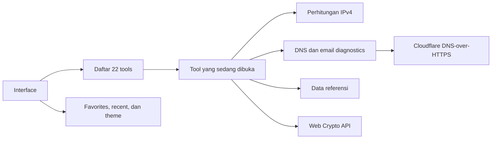

# Network Engineer Toolbox

<p align="center">
  
</p>

<p align="center">
  Tool kecil yang biasanya bikin kita buka lima tab.<br />
  Sekarang dikumpulin di satu tempat biar kerjaan nggak ikut muter-muter.
</p>

<p align="center">
  <a href="https://github.com/0x000TheNULL/Net-Tools"><strong>Repository</strong></a>
  ·
  <a href="https://msyaddin.cloud"><strong>Yang bikin</strong></a>
</p>

## Ini apaan?

**Network Engineer Toolbox** adalah kumpulan utility buat network engineer, system engineer, cloud engineer, atau siapa pun yang kesehariannya akrab dengan IP address, DNS record, email authentication, port, VLAN, dan data teknis lain yang kelihatannya kecil tapi tetap harus dihitung dengan benar.

Daripada pindah-pindah website cuma buat cari subnet mask, cek SPF, encode Base64, lalu buka tab lain lagi buat hash SHA-256, semuanya saya kumpulkan di sini.

Tampilannya dibuat seperti **engineering field manual**: ada nomor tool, metadata yang ringkas, hasil yang gampang dibaca, dan tombol copy yang memang ditaruh di tempat yang dibutuhkan. Bukan dashboard yang penuh grafik tapi pas dicari datanya malah nggak ketemu.

Versi singkatnya:

- Ada **22 utility** dalam lima bagian.
- Perhitungan dan crypto sebisa mungkin jalan langsung di browser.
- DNS lookup memakai DNS-over-HTTPS.
- Ada search, favorites, recent tools, dan command palette.
- Bisa dipakai tanpa bikin akun.
- Nggak ada grafik palsu yang bergerak cuma supaya terlihat sibuk.

## Isinya ada apa aja?

| Bagian | Buat apa? | Jumlah |
| --- | --- | ---: |
| `01 / IP & Subnet` | Hitung alamat, mask, range, dan wildcard | 5 tools |
| `02 / DNS` | Lookup record dan cek DNS yang berhubungan dengan email | 4 tools |
| `03 / Email` | Analisis SPF, DKIM, DMARC, dan email header | 4 tools |
| `04 / Network` | Referensi port, CIDR, IP range, VLAN, dan HTTP status | 5 tools |
| `05 / Utilities` | Encoding, hashing, encryption, key derivation, dan JSON | 4 tools |

## 01 / IP & Subnet

Bagian buat urusan IPv4 yang sebenarnya bisa dihitung manual, tapi ya buat apa kalau browser bisa ngerjain dengan lebih cepat dan lebih konsisten.

| ID | Tool | Hasilnya |
| --- | --- | --- |
| `IP/001` | Subnet Calculator | Network address, broadcast, subnet mask, wildcard, host pertama/terakhir, kapasitas, dan binary notation. |
| `IP/002` | CIDR to Subnet Mask | Mengubah prefix seperti `/24` menjadi `255.255.255.0`. |
| `IP/003` | Subnet Mask to CIDR | Validasi subnet mask lalu cari prefix CIDR-nya. |
| `IP/004` | IP Range Calculator | Menghitung jumlah alamat dari IP awal sampai IP akhir. |
| `IP/005` | Wildcard Mask Calculator | Membuat inverse mask buat ACL atau routing protocol. |

## 02 / DNS

Lookup DNS langsung dari workspace. Nggak perlu buka terminal kalau kebutuhannya cuma lihat record dengan cepat.

| ID | Tool | Hasilnya |
| --- | --- | --- |
| `DNS/001` | DNS Lookup | Query `A`, `AAAA`, `CNAME`, `MX`, `TXT`, `NS`, `SOA`, dan `PTR`. |
| `DNS/002` | Reverse DNS Lookup | Mengubah IPv4 menjadi reverse lookup name lalu mencari PTR record-nya. |
| `DNS/003` | MX Lookup | Melihat mail exchanger beserta priority-nya. |
| `DNS/004` | TXT / SPF Lookup | Mengambil TXT record dan memisahkan policy SPF. |

Query dikirim ke endpoint JSON DNS-over-HTTPS milik Cloudflare. Jadi domain dan tipe record yang sedang dicek memang keluar dari browser. Input tool lokal lainnya nggak ikut dikirim ke sana.

## 03 / Email

Email authentication memang kelihatannya cuma kumpulan record TXT. Sampai satu karakter salah dan email mulai nyasar ke spam. Bagian ini dibuat supaya proses bacanya nggak terlalu menyiksa.

| ID | Tool | Hasilnya |
| --- | --- | --- |
| `MAIL/001` | SPF Record Checker | Parse mechanism, hitung tekanan DNS lookup, dan baca terminal policy. |
| `MAIL/002` | DKIM Selector Helper | Membentuk hostname selector DKIM lalu mengambil public key record. |
| `MAIL/003` | DMARC Record Checker | Membaca policy, reporting address, percentage, dan alignment. |
| `MAIL/004` | Email Header Analyzer | Parse identity, message metadata, authentication verdict, dan received hops. |

## 04 / Network

Referensi yang biasanya dicari pas lagi buru-buru. Bisa dicari berdasarkan angka, nama service, atau istilah yang masih nyangkut sedikit di kepala.

| ID | Tool | Hasilnya |
| --- | --- | --- |
| `NET/001` | Port Reference | Daftar port TCP/UDP, nama service, dan catatan operasional. |
| `NET/002` | CIDR Reference Table | Perbandingan prefix, subnet mask, total address, dan usable host. |
| `NET/003` | Private / Public IP Reference | Klasifikasi private, public, loopback, link-local, multicast, dan reserved range. |
| `NET/004` | VLAN ID Reference | Range VLAN normal, extended, dan reserved berdasarkan IEEE 802.1Q. |
| `NET/005` | HTTP Status Reference | Cari HTTP status berdasarkan code, class, atau artinya. |

## 05 / Utilities

Tempat buat transformasi data yang kecil-kecil, tapi selalu muncul di waktu yang kurang tepat.

| ID | Tool | Hasilnya |
| --- | --- | --- |
| `UTIL/001` | Base64 Encode / Decode | Konversi teks UTF-8 ke Base64 atau sebaliknya. |
| `UTIL/002` | URL Encode / Decode | Encode dan decode nilai URI component. |
| `UTIL/003` | Encode & Crypto Lab | Sepuluh workflow encoding dan cryptography dengan klasifikasi yang jelas. |
| `UTIL/004` | JSON Formatter / Validator | Validasi, format, minify, copy, dan export JSON. |

## Bagian crypto, biar nggak salah sebut semuanya “encryption”

SHA-256 itu **hash**, bukan encryption. Base64 juga **encoding**, bukan cara menyembunyikan password. PBKDF2 dipakai buat **menurunkan key**, bukan buat encrypt pesan.

Kedengarannya cerewet, tapi istilah yang benar itu penting. Apalagi kalau hasilnya nanti masuk dokumentasi, audit, atau production config.

| No. | Method | Sebenarnya buat apa? | Bisa dibalik? |
| ---: | --- | --- | :---: |
| 01 | Base64 | Encoding binary menjadi teks | Ya |
| 02 | URL Percent | Encoding URI component | Ya |
| 03 | SHA-256 | Hash satu arah 256-bit | Tidak |
| 04 | SHA-384 | Hash satu arah 384-bit | Tidak |
| 05 | SHA-512 | Hash satu arah 512-bit | Tidak |
| 06 | HMAC-SHA-256 | Tanda tangan integritas dengan secret | Diverifikasi, bukan didecode |
| 07 | AES-GCM-256 | Symmetric encryption yang sekaligus authenticated | Ya, pakai key |
| 08 | AES-CBC-256 | Symmetric encryption untuk kompatibilitas sistem lama | Ya, pakai key |
| 09 | RSA-OAEP-2048 | Asymmetric encryption dengan public/private key | Ya, pakai private key |
| 10 | PBKDF2-SHA-256 | Membentuk key dari passphrase | Tidak |

### Detail yang perlu diketahui sebelum pencet tombol

- AES memakai key 32 byte yang ditampilkan sebagai 64 karakter hexadecimal.
- AES-GCM memakai random IV 96-bit dan menghasilkan authenticated ciphertext.
- AES-CBC memakai random IV 128-bit, tapi **tidak memberikan autentikasi**. Kalau nggak sedang mengejar kompatibilitas, pilih AES-GCM.
- RSA key pair dibuat di browser lalu diekspor sebagai public key SPKI dan private key PKCS#8 dalam format PEM.
- RSA-OAEP 2048 + SHA-256 dibatasi maksimal 190 byte UTF-8. Data besar sebaiknya dienkripsi dengan AES, lalu key AES-nya dibungkus memakai RSA.
- PBKDF2 menerima 10.000 sampai 2.000.000 iteration dan menghasilkan key 256-bit.
- Key, plaintext, dan ciphertext cuma berada di state browser selama kamu nggak menyalinnya ke tempat lain.

> [!IMPORTANT]
> Crypto Lab ini utility engineering, bukan key-management platform. Buat key production yang berumur panjang, tetap gunakan secret manager, KMS, atau HSM yang memang dibangun buat itu. Jangan simpan private key penting di catatan meeting. Serius.

## Cara kerjanya, versi nggak bikin pusing



Nggak ada database dan nggak ada backend aplikasi khusus untuk feature set sekarang. Hampir semua proses dikerjakan di sisi browser. Pengecualiannya adalah DNS lookup karena, ya, record DNS memang harus ditanya ke resolver.

## Stack yang dipakai

| Bagian | Teknologi | Kenapa dipakai? |
| --- | --- | --- |
| UI | React 19 | Component model-nya enak buat banyak tool dengan pola yang sama. |
| Language | TypeScript 5.9 | Biar data network nggak ditambah kejutan dari tipe yang salah. |
| Runtime | Vinext | Runtime Next-compatible dengan output Cloudflare Workers. |
| Styling | Tailwind CSS 4 + CSS tokens | Utility cepat, identitas visual tetap dipegang design system sendiri. |
| UI primitives | shadcn-compatible + Base UI | Buat interaction primitive tanpa bikin semuanya dari nol. |
| Icons | Lucide React | Ringkas dan konsisten. Nggak perlu koleksi SVG random. |
| Cryptography | Web Crypto API | Native di browser dan nggak butuh mengirim key ke server. |
| DNS | Cloudflare DNS-over-HTTPS | Query DNS lewat HTTPS dengan response JSON. |
| Build | Vite + Vinext + Wrangler | Build dan runtime yang cocok buat Cloudflare Workers. |
| Quality | Oxlint + Oxfmt | Menjaga codebase tetap waras. |

## Mau jalanin di lokal?

Yang dibutuhkan:

- Node.js `22.13.0` atau lebih baru
- npm
- Browser modern yang mendukung Web Crypto API

```bash
git clone https://github.com/0x000TheNULL/Net-Tools.git
cd Net-Tools
npm ci
npm run dev
```

Lalu buka [http://localhost:3000](http://localhost:3000).

### Command yang tersedia

| Command | Kegunaan |
| --- | --- |
| `npm run dev` | Menjalankan development server. |
| `npm run build` | Membuat production build. |
| `npm run start` | Menjalankan Worker hasil build lewat Wrangler. |
| `npm run lint` | Menjalankan Oxlint. |
| `npm run format` | Merapikan file yang didukung Oxfmt. |

## Struktur proyek buat yang mau ngoprek

```text
Net-Tools/
├── app/                    # Route, metadata, dan global design system
├── components/             # Landing page, toolbox shell, dan UI primitives
├── data/                   # Registry semua tool
├── features/tools/         # Implementasi tool yang tampil di workspace
│   ├── crypto-lab.tsx
│   ├── dns-tools.tsx
│   ├── network-tools.tsx
│   ├── shared.tsx
│   ├── tool-surface.tsx
│   └── utility-tools.tsx
├── lib/                    # Logic network, DNS, crypto, codec, dan reference
├── public/                 # Favicon dan social preview
├── types/                  # Shared TypeScript types
├── package.json
└── vite.config.ts
```

Beberapa file yang paling relevan:

- `data/tools.ts` — pusat nama, kategori, deskripsi, tags, dan ID seperti `IP/001`.
- `features/tools/tool-surface.tsx` — menghubungkan registry dengan component tool.
- `lib/network.ts` — parsing dan perhitungan IPv4.
- `lib/dns.ts` — DNS-over-HTTPS serta parser SPF, DMARC, dan email header.
- `lib/crypto.ts` — digest, HMAC, AES, RSA, dan PBKDF2.
- `lib/reference-data.ts` — data buat tabel referensi.

## Data kamu pergi ke mana?

### Tetap di browser

- Perhitungan subnet dan IPv4
- Pencarian tabel referensi
- Base64 dan URL codec
- Format dan validasi JSON
- SHA dan HMAC
- AES dan RSA
- PBKDF2
- Parsing email header
- Favorites, recent tools, dan theme

### Keluar dari browser

DNS lookup mengirim domain/reverse lookup name dan tipe record ke:

```text
https://cloudflare-dns.com/dns-query
```

Request-nya memakai header `Accept: application/dns-json`. Saat ini nggak ada analytics pihak pertama, user account, database, atau penyimpanan secret di server.

## Sedikit soal state

Preference sederhana disimpan di `localStorage`:

| Key | Isi |
| --- | --- |
| `netops:favorites` | ID tool yang di-pin |
| `netops:recent` | Lima tool yang terakhir dibuka |
| `netops:theme` | Theme terang atau gelap |

Command palette bisa dibuka dengan `Ctrl+K` atau `⌘K`. Search-nya membaca nama tool, deskripsi, kategori, dan tags.

## Yang sudah dicek

- Production build berhasil lewat `npm run build`.
- Landing page dan workspace dicek langsung di browser.
- SHA-256 menghasilkan digest lewat interface yang sebenarnya, bukan cuma test function terpisah.
- AES-GCM-256 berhasil encrypt lalu decrypt ke plaintext awal.
- RSA-OAEP-2048 berhasil generate key pair, encrypt, lalu decrypt lagi.
- Layout desktop dan responsive rules sudah diperiksa.
- `git diff --check` bersih sebelum dipublikasikan.

Repo ini membawa koleksi primitive shadcn-compatible yang cukup besar. Full lint bisa saja menampilkan rule accessibility/compiler dari primitive generated yang bahkan nggak dipakai di aplikasi aktif. Production build dan jalur aplikasi utama tetap divalidasi terpisah.

## Deployment

Build diarahkan ke runtime yang kompatibel dengan Cloudflare Workers lewat Vinext dan Wrangler.

```bash
npm run build
npm run start
```

Ini bukan project static export biasa, jadi GitHub Pages bukan target deployment default. Repo-nya boleh tinggal di GitHub, tapi hasil build-nya sebaiknya dijalankan di platform yang mendukung Workers/Vinext.

## Mau nambah tool?

Silakan. Alurnya kira-kira begini:

1. Tambahkan `ToolDefinition` di `data/tools.ts`.
2. Buat component tool di `features/tools/`.
3. Daftarkan icon dan renderer-nya di `features/tools/tool-surface.tsx`.
4. Taruh logic perhitungan atau parsing murni di `lib/` kalau memungkinkan.
5. Siapkan empty, loading, validation, dan error state. Jangan cuma happy path.
6. Cek keyboard navigation dan layout mobile.
7. Jalankan production build sebelum bikin pull request.

Kalau menambah feature, tolong pertahankan prinsip dasarnya: istilah teknis harus benar, data lokal jangan dikirim sembarangan, hasil harus gampang dibaca, dan interface nggak perlu teriak-teriak buat terlihat canggih.

## Lisensi

Belum ada open-source license yang ditambahkan. Repo ini bisa dilihat publik, tapi bukan berarti otomatis bebas disalin, dimodifikasi, atau didistribusikan ulang. Hak cipta tetap milik author sampai ada license yang menyatakan sebaliknya.

## Yang bikin

**Muhammad Syawalludin**  
Technology / Infrastructure Engineer

- Personal site: [msyaddin.cloud](https://msyaddin.cloud)
- GitHub: [@0x000TheNULL](https://github.com/0x000TheNULL)

---

Kalau tool ini berhasil menyelamatkan satu sesi troubleshooting dari lima tab yang isinya mirip-mirip, berarti tugasnya selesai.
